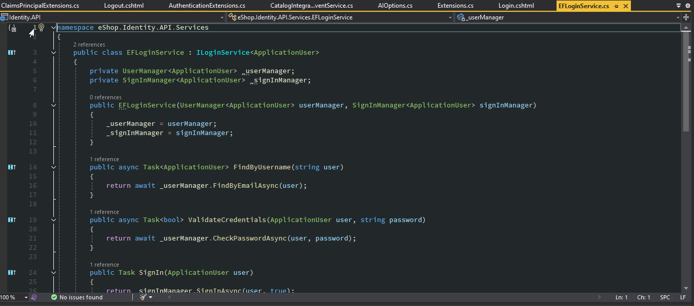
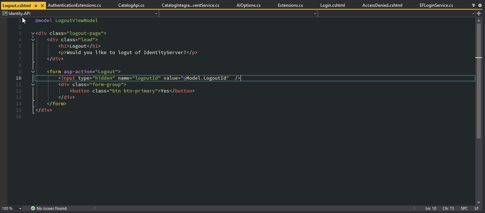
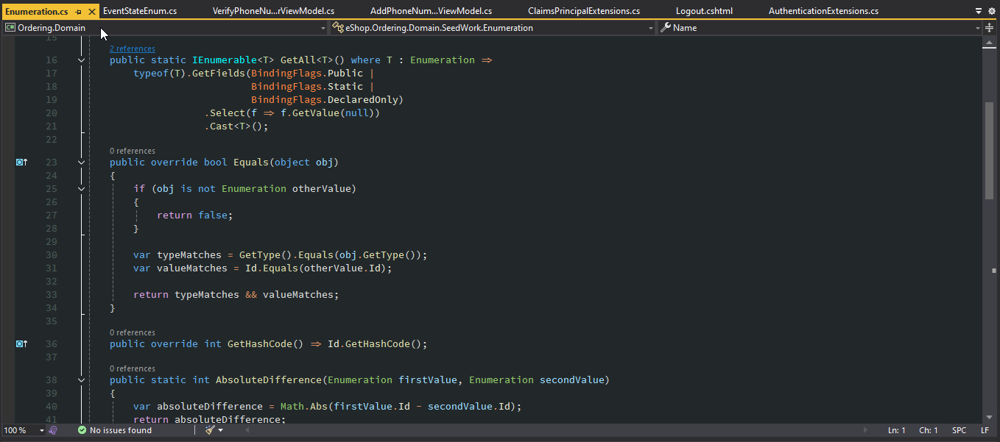

# Shadow Dark Theme

## Examples

## Installation
1. Download the extension (.vsix file)
2. Choose the theme (Tools -> Theme -> Shadow Dark)

## Fonts

I like to use a combination of fonts for a few different things...

Tools -> Options -> Environment -> Fonts and Colours

Package Manager Console: [JetBrians Mono](https://github.com/JetBrains/JetBrainsMono) Medium
Text Editor: [Hasklig](https://github.com/i-tu/Hasklig) Medium (OTF)
